# Nimbus User Guide

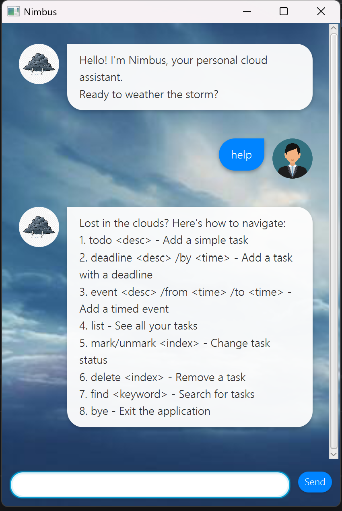

**Nimbus** is a weather-themed desktop task manager. It is optimized for users who prefer a Command Line Interface (CLI) but enjoy the visual feedback of a Graphical User Interface (GUI). Nimbus helps you navigate the "clouds" of your schedule with a chill, atmospheric personality.

## Table of Contents
* [Quick Start](#quick-start)
* [Features](#features)
    * [Adding a todo: `todo`](#adding-a-todo-todo)
    * [Adding a deadline: `deadline`](#adding-a-deadline-deadline)
    * [Adding an event: `event`](#adding-an-event-event)
    * [Listing tasks: `list`](#listing-tasks-list)
    * [Finding tasks: `find`](#finding-tasks-find)
    * [Updating a task: `update`](#updating-a-task-update)
    * [Marking a task as done: `mark`](#marking-a-task-as-done-mark)
    * [Unmarking a task: `unmark`](#unmarking-a-task-unmark)
    * [Deleting a task: `delete`](#deleting-a-task-delete)
    * [Getting help: `help`](#getting-help-help)
    * [Exiting the program: `bye`](#exiting-the-program-bye)
* [FAQ](#faq)

---

## Quick Start

1. Ensure you have Java 17 or above installed on your computer.
2. Download the latest `nimbus.jar` from the [releases page](https://github.com/nigelgm/ip/releases).
3. Copy the file to the folder you want to use as the *home folder* for your task manager.
4. Double-click the file to start the application.
5. Type the command in the command box and press Enter to execute it. e.g. typing `help` and pressing Enter will open the help menu.
6. Use the **Up** and **Down** arrow keys to easily scroll through your past command history.
7. Refer to the features below for details of each command.

## Features

### Adding a todo: `todo`
Adds a standard task to your list without any specific time constraints.

Format: `todo <description>`

**Example:**
`todo read lecture notes`

**Expected outcome:**
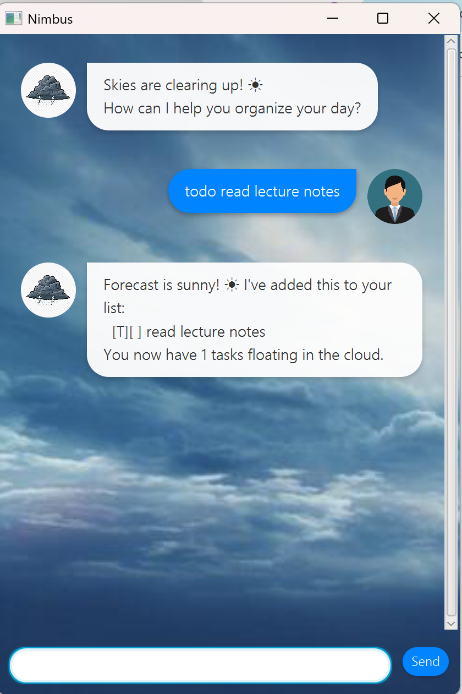

### Adding a deadline: `deadline`
Adds a task that needs to be done before a specific date and time. The date format must be `yyyy-mm-dd HHmm`.
The time component is optional. If omitted, the deadline defaults to the end of the day.

Full Format: `deadline <description> /by yyyy-mm-dd HHmm`
Minimal Format: `deadline <description> /by yyyy-mm-dd`

**Example:**
`deadline return library book /by 2026-02-20`

**Expected outcome:**
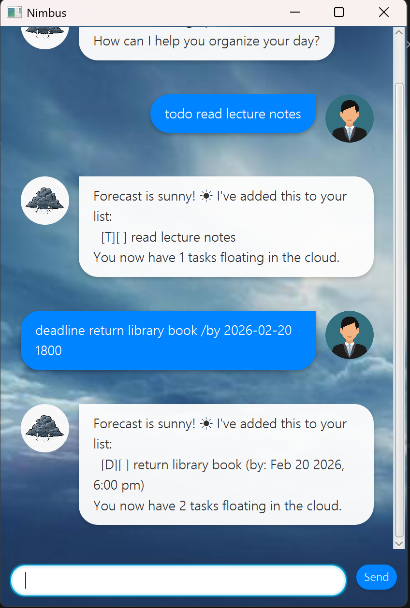

### Adding an event: `event`
Adds a task that occurs over a specific time range. Both start and end times are required in the format `yyyy-mm-dd HHmm`.

Format: `event <description> /from <start> /to <end>`

**Example:**
`event project meeting /from 2026-02-21 1400 /to 2026-02-21 1600`

**Expected outcome:**
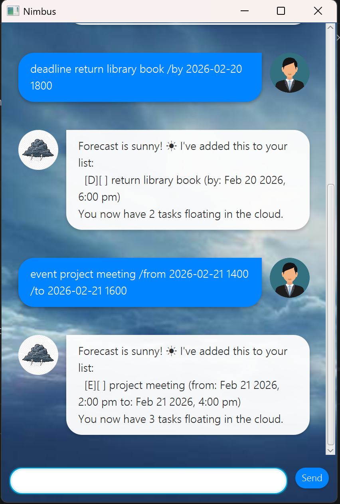

### Listing tasks: `list`
Displays all tasks currently in your list, showing their index, type, status, and details.

Format: `list`

**Expected outcome:**
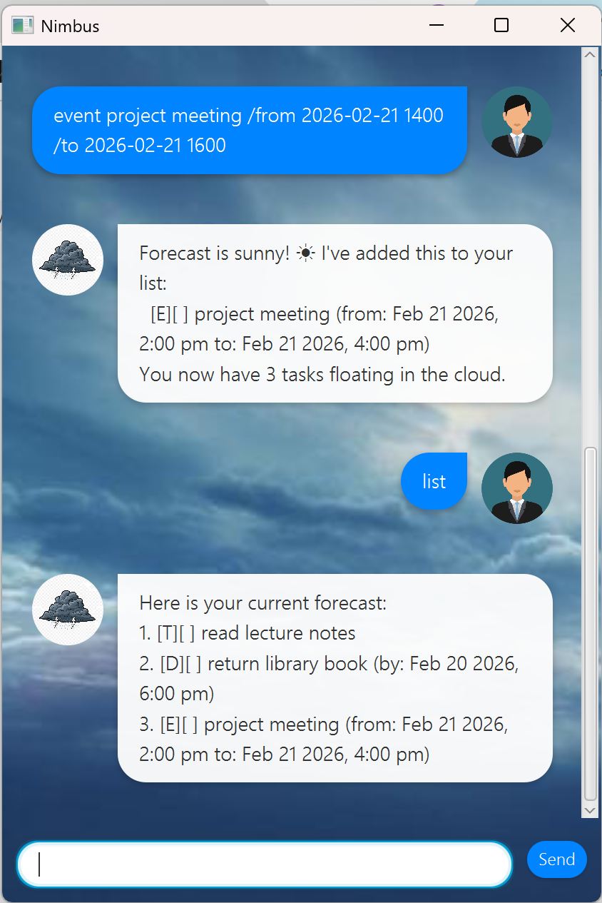

### Finding tasks: `find`
Finds tasks whose descriptions contain the given keyword.

Format: `find <keyword>`

**Example:**
`find book`

**Expected outcome:**
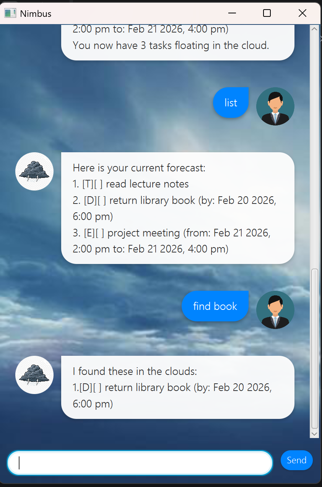

### Updating a task: `update`
Updates the details of an existing task without deleting it. You can update the description, the deadline time, or the event start/end times.
If you provide the command without new values, Nimbus will confirm the "update," but your data will remain unchanged.
You can update just the description by typing after the index, or use /by, /from, or /to to update specific timing.

Format: `update <index> <flag> <value>`

**Examples:**
* `update 1 read new book` (Updates description)
* `update 2 /by 2026-12-25 1200` (Updates deadline)

**Expected outcome:**
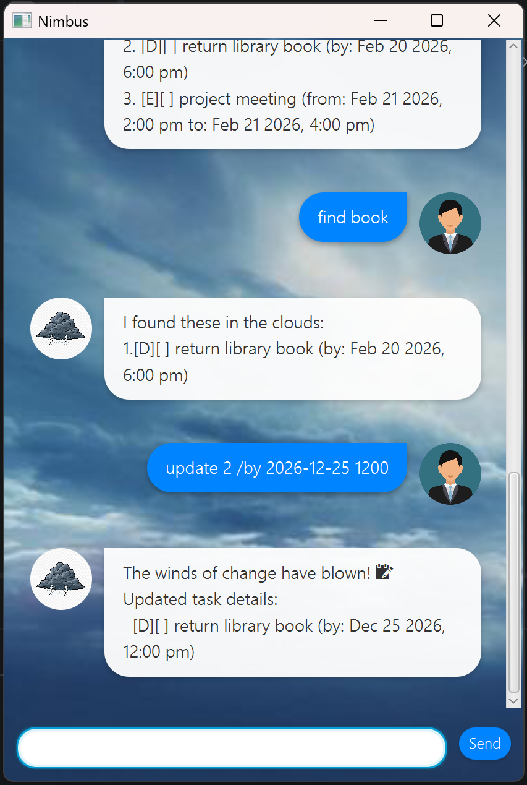

### Marking a task as done: `mark`
Marks an existing task as completed.

Format: `mark <index>`

**Example:**
`mark 1`

**Expected outcome:**
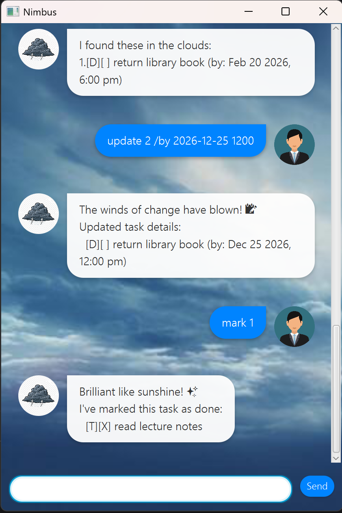

### Unmarking a task: `unmark`
Marks a completed task as not done yet.

Format: `unmark <index>`

**Example:**
`unmark 1`

**Expected outcome:**
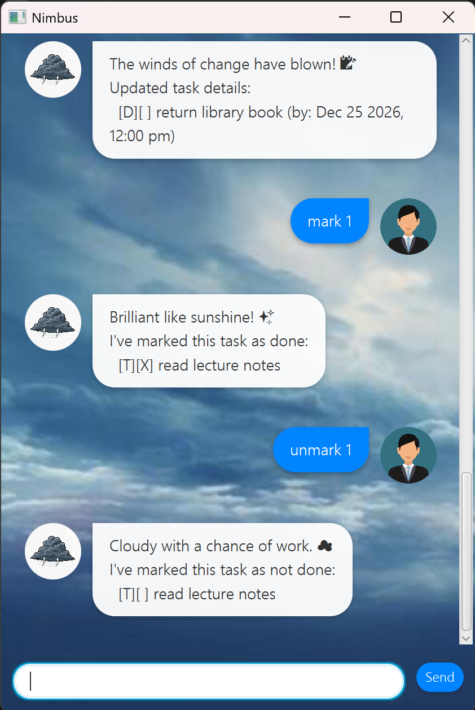

### Deleting a task: `delete`
Removes the specified task from the list permanently.

Format: `delete <index>`

**Example:**
`delete 3`

**Expected outcome:**
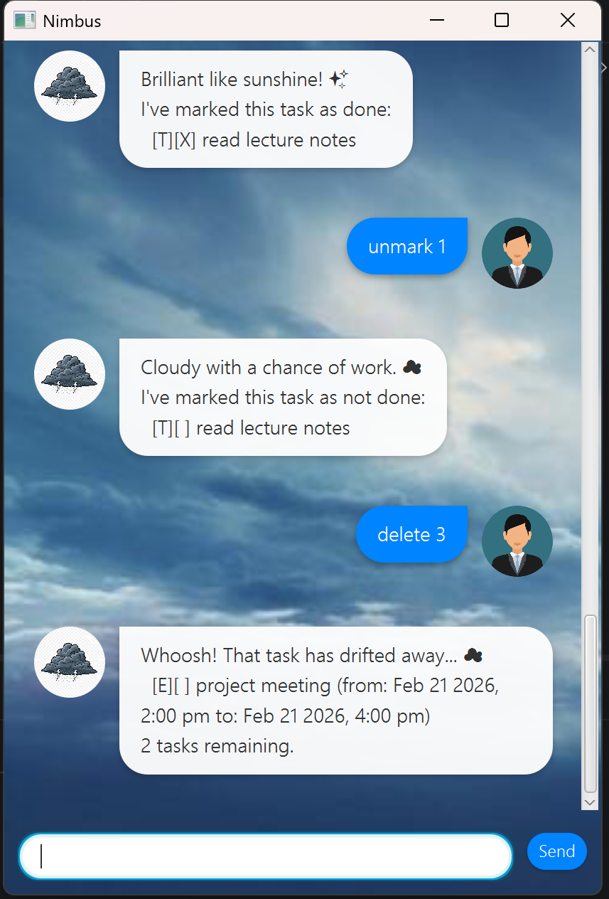

### Getting help: `help`
Displays a list of all available commands if you are unsure of the syntax.

Format: `help`

**Expected outcome:**
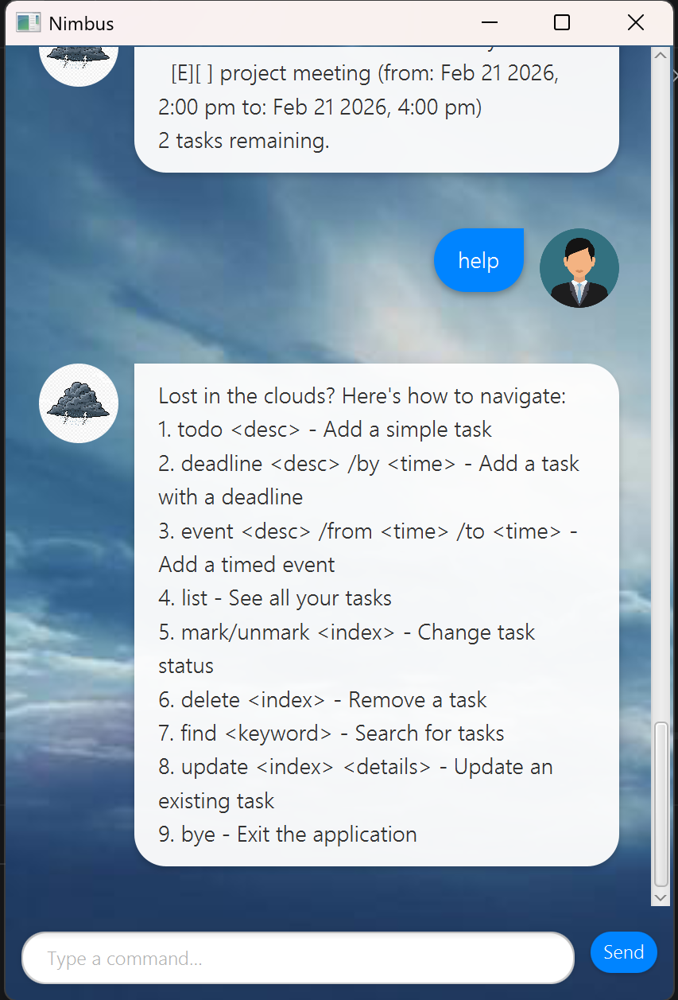

### Exiting the program: `bye`
Exits and closes the program. Also saves your data.

Format: `bye`

## FAQ

**Q**: How do I transfer my data to another computer?
**A**: Install the app in the other computer and overwrite the empty data file, it creates with the file `data/nimbus.txt` from your previous computer.

**Q**: Can I resize the window?
**A**: Yes, the interface is responsive and will adjust to your screen size.

**Q**: Is there a way to reuse or view my previous commands?
**A**: Yes! Click on the command input box and use the **Up** and **Down** arrow keys on your keyboard to scroll through your command history, just like a standard terminal.